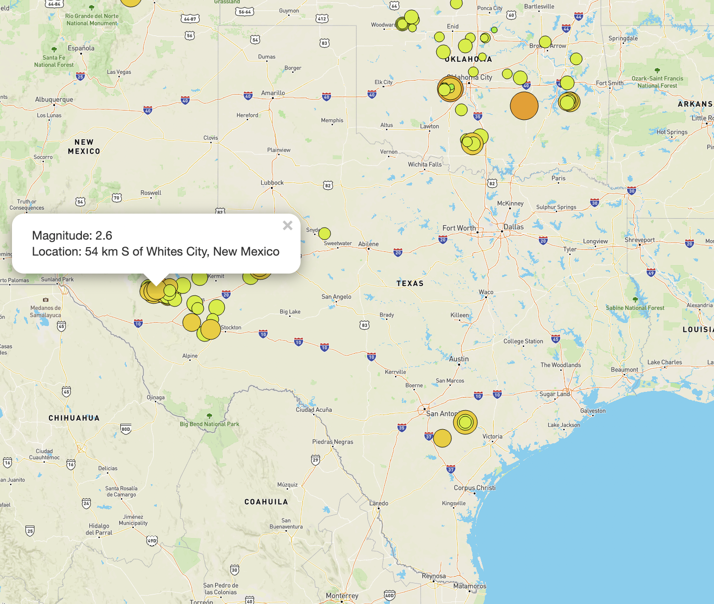
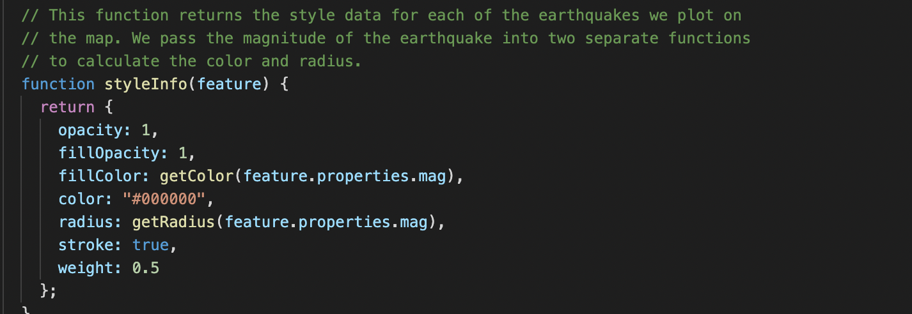
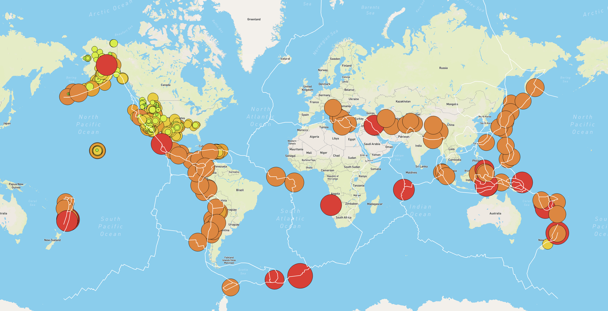

# Mapping_Earthquakes.

## Overview of Project

In this mini-project located in my "Earthquake_Challenge" folder, I will be creating insightful data visualizations with interactive features in order to map earthquakes around the world. In order to create this interactive visualiztion webpage, I will need to harnest the collective power of a few scripting languages and libraries.

**Languages and Libraries used.**
1. Languages
   - Javascript 
   - HTML
2. Libraries
   - Leaflet
   - D3 (Data-Driven Documents)
   - Mapbox Map (using APIs)

## Key Features of the Site.

The first thing to note about this map are the pop-up markers that appear when we click on any registered earthquake. The pop-up markers will give the user precise information on both the magnitutude and location of the earthquake that was selected.

- 

The second notable feature is the size and color of the markers that are created for each earthquake. The radius(size) of each marker is dependent on the magnitude of the earthquake and so are the subsequent colors. The image above shows the varying styles of the markers. The styles for both the radius and color were created by retrieving the mapnitude properties from our imported geojson file. Below is a snippet of the code used in the "challenge_logic.js" that stylels our markers. 

- 

- Allowing for this kind of styling ensures that bigger earthquakes always pop out to the users, by making them appear both larger and darker than earthquakes of less magnitude. There is also a legend on the bottom right corner that provides a range for the magnitude of the earthquakes based on the color of our marker. The legend can be seen on the final image of this Readme file.

### Fault Line.

To make this page more informative, I also added fault lines as another layer along-side the markers. Earthquakes typically happen near major fault lines, and the map supports that fact by mapping out the major fault lines all over the world. With the fault lines added, we can see that not only do earthquakes happen more frequently near the fault lines, but they are also much more severe.

### Interactive Feature of the Map.

The interactive feature of this map is the overlay that can be found at the top right hand corner of the page. With the overlay the user is able to filter the map between 2 categories the map view, and the data layers displayed. Below is a brief pointer on the map options as well as the data layers that can be filtered.

1. Maps
   - Street
   - Satelite
2. Layers
   - Earthquakes
   - Tectonic Plates
   - Major Earthquakes

